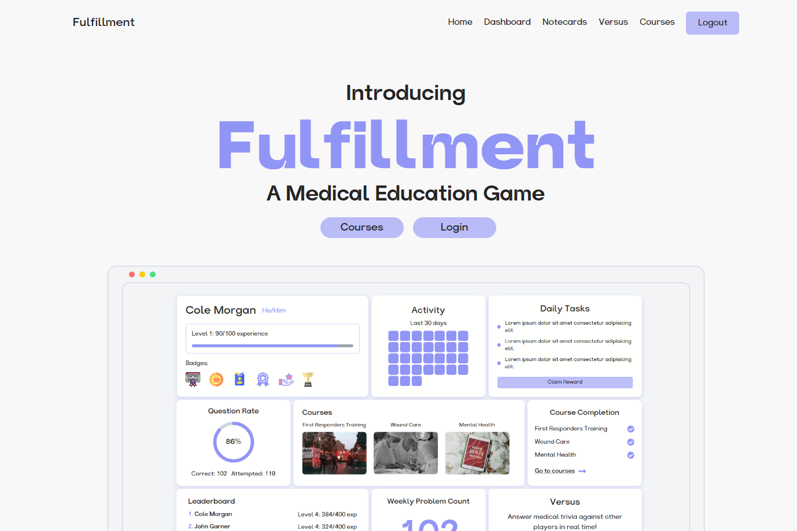

# Fulfillment: Your Comprehensive Medical Learning Companion



Welcome to Fulfillment! This web app is designed to revolutionize continuous medical education through a micro-credentialing system that incentivizes ongoing learning and practice for front-line medical professionals.

[Live Demo](https://fufillment-n5cn.vercel.app/)

## Table of Contents

- [Introduction](#introduction)
- [Features](#features)
- [Technologies Used](#technologies-used)
- [Setup and Installation](#setup-and-installation)
- [Inspiration](#inspiration)
- [What We Learned](#what-we-learned)
- [Challenges Faced](#challenges-faced)
- [Future Improvements](#future-improvements)
- [Contributors](#contributors)

## Introduction

Fulfillment addresses the critical need for continuous, bite-sized learning in medicine. Our platform transforms traditional, often outdated medical education models into an agile, responsive system that evolves with the rapidly changing medical field. By offering micro-credentials, we encourage medical professionals to engage in frequent, focused learning that can be immediately applied to their practice.

Our system is designed to combat medical errors - one of the leading causes of death and poor health outcomes - by ensuring that medical professionals' skills and knowledge remain current with the latest evidence-based practices and technologies. Fulfillment makes continuous professional development accessible, engaging, and directly relevant to daily medical practice.


## Features

- **Courses**: Study entire courses related to various medical topics at your own convenience.
- **Notecards**: A feature where you can create and review notecards to reinforce your learning.
- **Versus**: A timed trivia game that pits two players against each other with a random set of medical questions.
- **Badges and XP System**: Earn badges and experience points to keep the learning process motivating and rewarding.
- **Dashboard**: Track your progress, view your achievements, and manage your learning journey.

## Technologies Used

- React
- TypeScript
- Vite
- TailwindCSS
- Framer Motion
- Firebase

## Setup and Installation

To set up and run this project locally, follow these steps:

1. **Clone the repository**:

   ```bash
   git clone https://github.com/colemmorgan/Medihacks2024
   cd Medihacks2024
   ```

2. **Install dependencies**:

   ```bash
   npm install
   ```

3. **Set up Firebase**:

   - Create a Firebase project.
   - Set up Firestore and Authentication.
   - Replace the Firebase config in the project with your Firebase project credentials.

4. **Configure Environment Variable**

   - The set of environment variables to configure has been provided in `.env.example` at the root of this project

5. **Run the development server**:

   ```bash
   npm run dev
   ```

6. **Open the app**:
   - Open your browser and navigate to `http://localhost:5173`.

## Inspiration

We were inspired by the need to make medical learning more engaging and accessible. The traditional methods of studying from a ton of books and websites can be monotonous and inefficient. By gamifying the learning experience and providing centralized resources, we aim to make learning a delightful experience for medical professionals.

## What We Learned

Through this project, we gained a deeper understanding of:

- Building scalable web applications using React and TypeScript.
- Enhancing user experience with TailwindCSS and Framer Motion.
- Integrating Firebase for authentication and real-time database functionality.
- Implementing gamification elements to motivate users.

## Challenges Faced

- **Data Integration**: Collating and structuring medical data from various sources into a proper format.
- **Firebase Integration**: Setting up and configuring Firebase for authentication and real-time database functionality.
- **React States**: Managing and updating complex state logic in React to ensure a smooth user experience.
- **User Experience (UX)**: Ensuring the app is intuitive and enjoyable for users of all ages and technical proficiencies.
- **Responsive Design**: Making sure the app is fully responsive and works well on a variety of devices and screen sizes.
- **Real-time Features**: Implementing the real-time trivia game and ensuring smooth performance under different network conditions.

## Future Improvements

- **Expand Course Library**: Continuously add more courses and learning materials.
- **Community Features**: Introduce forums and discussion boards for peer-to-peer learning.
- **Advanced Analytics**: Provide detailed analytics and insights to help users track their learning progress more effectively.
- **Mobile App**: Develop a mobile version of the app for on-the-go learning.

## Contributors

- [Savio Xavier](https://github.com/savioxavier)
- [Cole Morgan](https://github.com/colemmorgan)
